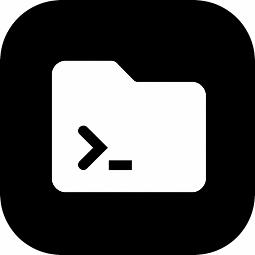
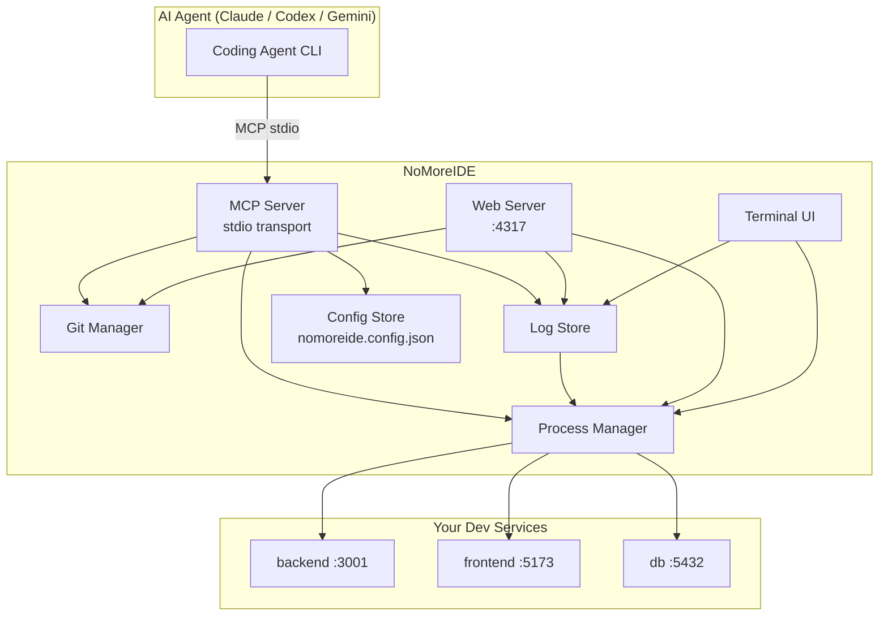

<div align="center">



# NoMoreIDE

**The AI-native terminal workbench for the post-IDE development loop.**

[](https://www.npmjs.com/package/nomoreide)
[](https://www.npmjs.com/package/nomoreide)
[](https://github.com/Rorogogogo/nomoreide/stargazers)
[](LICENSE)
[](https://nodejs.org)
[](https://modelcontextprotocol.io)

Give your coding agents and yourself a **shared local control surface** for services, ports, logs, Git review, and MCP workflows — no IDE required.

[Quick Start](#quick-start) · [MCP Setup](#-connect-your-ai-agent) · [CLI Reference](#cli) · [MCP Tools](#mcp-tools) · [Architecture](#architecture)

</div>

---

## What Is NoMoreIDE?

NoMoreIDE is a lightweight process manager, Git reviewer, log aggregator, and MCP server — all in one `npx` command. It gives AI coding agents (Claude Code, Codex CLI, Gemini CLI, and others) a safe, structured window into your running dev environment through the **Model Context Protocol (MCP)**, while also providing a terminal UI and a local React web dashboard for humans.

```
┌──────────────────────────────────────────────────────┐
│                    Your Project                       │
│                                                      │
│   Claude Code / Codex CLI / Gemini CLI               │
│           │                                          │
│     MCP (stdio)                                      │
│           │                                          │
│   ┌───────▼────────┐    ┌──────────────────────┐    │
│   │  NoMoreIDE MCP │◄──►│  Process Manager      │    │
│   │  Server        │    │  Log Store            │    │
│   └───────┬────────┘    │  Git Manager          │    │
│           │             │  Config Store         │    │
│     HTTP API            └──────────────────────┘    │
│           │                                          │
│   ┌───────▼──────────────────────────┐              │
│   │  Web UI  (localhost:4317)        │              │
│   │  Terminal UI (nomoreide tui)     │              │
│   └──────────────────────────────────┘              │
└──────────────────────────────────────────────────────┘
```

---

## Connect Your AI Agent

NoMoreIDE runs as a **local stdio MCP server**. Pick your agent CLI and paste the one-liner — that's it.

### Claude Code

```bash
claude mcp add --transport stdio nomoreide -- npx -y nomoreide
```

> Want to share the config with your whole team? Use project scope to commit a `.mcp.json`:
>
> ```bash
> claude mcp add --transport stdio --scope project nomoreide -- npx -y nomoreide
> ```

Then confirm inside Claude Code:

```
/mcp
```

<details>
<summary>Manual config (<code>.mcp.json</code> or Claude settings)</summary>

```json
{
  "mcpServers": {
    "nomoreide": {
      "command": "npx",
      "args": ["-y", "nomoreide"]
    }
  }
}
```

</details>

---

### Codex CLI

```bash
codex mcp add nomoreide -- npx -y nomoreide
```

<details>
<summary>Manual config (<code>~/.codex/config.toml</code>)</summary>

```toml
[mcp_servers.nomoreide]
command = "npx"
args    = ["-y", "nomoreide"]
```

</details>

Then confirm inside Codex:

```
/mcp
```

---

### Gemini CLI

Open your Gemini CLI settings file (`~/.gemini/settings.json` or the path shown by `gemini config`) and add:

```json
{
  "mcpServers": {
    "nomoreide": {
      "command": "npx",
      "args": ["-y", "nomoreide"]
    }
  }
}
```

Restart Gemini CLI, then verify:

```
/mcp
```

---

### Local Checkout (any agent)

If you prefer to point agents at a locally built binary instead of the published npm package:

```json
{
  "mcpServers": {
    "nomoreide": {
      "command": "node",
      "args": ["/absolute/path/to/nomoreide/dist/index.js"]
    }
  }
}
```

---

## Quick Start

Run without installing:

```bash
npx -y nomoreide
```

Install globally:

```bash
npm install -g nomoreide
```

Build from source:

```bash
git clone https://github.com/Rorogogogo/nomoreide.git
cd nomoreide
npm install
npm run build
```

---

## Architecture



---

## Feature Overview

| Feature | CLI | TUI | Web UI | MCP |
|---|:---:|:---:|:---:|:---:|
| Start / stop / restart services | ✓ | ✓ | ✓ | ✓ |
| Bundle orchestration | ✓ | | ✓ | ✓ |
| Port conflict detection | | | ✓ | ✓ |
| Real-time log streaming | ✓ | ✓ | ✓ | ✓ |
| Git status & diff | ✓ | | ✓ | ✓ |
| Stage / unstage / commit | ✓ | | ✓ | ✓ |
| Branch management | ✓ | | ✓ | ✓ |
| Safe Git (no force-push, no reset) | ✓ | ✓ | ✓ | ✓ |

---

## Running the Interfaces

### MCP Server (default)

```bash
nomoreide
# or from source:
npm run dev
```

### Terminal UI

```bash
nomoreide tui
```

### Web Dashboard

```bash
nomoreide web
# custom port:
nomoreide web --port=4320
```

The web dashboard is available at `http://127.0.0.1:4317` by default.

---

## CLI

### Services

```bash
# Register a service
nomoreide add service backend \
  --command "npm run dev" \
  --cwd /absolute/path/to/backend \
  --port 3001

# Register a bundle (ordered group of services)
nomoreide add bundle full-stack db backend frontend

# List everything
nomoreide list

# Lifecycle
nomoreide start backend
nomoreide stop backend
nomoreide restart backend
nomoreide start full-stack
nomoreide stop full-stack

# Logs (in-memory, current process)
nomoreide logs backend
```

### Git

NoMoreIDE exposes **read-safe** Git operations only — no hard reset, no clean, no force push, no branch deletion.

```bash
# Status & diff
nomoreide git status --cwd /path/to/repo
nomoreide git diff   --cwd /path/to/repo

# Staging & committing
nomoreide git stage   --cwd /path/to/repo src/index.ts README.md
nomoreide git unstage --cwd /path/to/repo src/index.ts
nomoreide git commit  --cwd /path/to/repo --message "feat: add dashboard"

# History
nomoreide git log --cwd /path/to/repo

# Branches
nomoreide git branch        --cwd /path/to/repo
nomoreide git fetch         --cwd /path/to/repo
nomoreide git switch        --cwd /path/to/repo feature/my-work
nomoreide git create-branch --cwd /path/to/repo feature/new-work

# Register repos for the web UI
nomoreide git add-repo    app --path /path/to/repo
nomoreide git select-repo app
```

---

## MCP Tools

All tools are prefixed with `nomoreide_` and are available to any connected MCP client.

### Service Tools

| Tool | Description |
|---|---|
| `nomoreide_list_services` | List all registered services and bundles |
| `nomoreide_register_service` | Register a new service |
| `nomoreide_start_service` | Start a registered service |
| `nomoreide_stop_service` | Stop a running service |
| `nomoreide_restart_service` | Restart a running service |
| `nomoreide_read_logs` | Read recent in-memory logs for a service |
| `nomoreide_register_bundle` | Register a bundle of services |
| `nomoreide_start_bundle` | Start all services in a bundle |
| `nomoreide_stop_bundle` | Stop all services in a bundle |
| `nomoreide_status` | Overall server status |
| `nomoreide_open_ui` | Open the local web UI |
| `nomoreide_close_ui` | Close the local web UI |

### Git Tools

| Tool | Description |
|---|---|
| `nomoreide_git_status` | Show working tree status |
| `nomoreide_git_diff` | Show unstaged diff |
| `nomoreide_git_staged_diff` | Show staged diff |
| `nomoreide_git_log` | Show recent commits |
| `nomoreide_git_branches` | List branches |
| `nomoreide_git_fetch` | Fetch from remote |
| `nomoreide_git_switch_branch` | Switch to a branch |
| `nomoreide_git_create_branch` | Create a new branch |
| `nomoreide_git_stage` | Stage specific files |
| `nomoreide_git_unstage` | Unstage specific files |
| `nomoreide_git_commit` | Commit staged changes |
| `nomoreide_git_register_repository` | Register a repo path |
| `nomoreide_git_select_repository` | Select the active repo |

---

## Example Configurations

### Service Definition (via MCP)

```json
{
  "name": "backend",
  "command": "npm run dev",
  "cwd": "/absolute/path/to/project/backend",
  "port": 3001,
  "env": {
    "NODE_ENV": "development"
  },
  "description": "REST API server"
}
```

### Bundle Definition (via MCP)

```json
{
  "name": "full-stack",
  "services": ["db", "backend", "frontend"]
}
```

Start the whole stack in one call:

```json
{ "name": "full-stack" }
```

---

## Safety Model

NoMoreIDE is designed to be **safe for AI agents to call without guard rails**:

- Does not scan or enumerate the whole filesystem
- Does not kill processes it did not start
- Reports port conflicts instead of terminating the occupying process
- Git tools omit all destructive operations (no `reset --hard`, `clean`, `push --force`, or `branch -D`)
- Config is scoped to `nomoreide.config.json` in the launch directory
- Logs are written only to `.nomoreide/logs/`

---

## Development

```bash
npm test        # run the full test suite (vitest)
npm run build   # compile TypeScript → dist/
npm run dev     # run from source (tsx)
```

---

## Contributing

Issues and pull requests are welcome at [github.com/Rorogogogo/nomoreide](https://github.com/Rorogogogo/nomoreide/issues).  
If this tool saved you from opening VS Code today, consider leaving a ⭐.

---

<div align="center">

AGPL-3.0 + Commercial · Built by [Rorogogogo](https://github.com/Rorogogogo)

</div>

## License

This project is **dual-licensed**:

- 🆓 **AGPL-3.0** — free for personal use, open-source forks, and projects themselves open-sourced under a compatible license. See [LICENSE](LICENSE).
- 💼 **Commercial license** — required for closed-source products, proprietary internal tools, or paid / hosted services where AGPL-3.0's copyleft and network-use obligations don't fit. See [COMMERCIAL.md](COMMERCIAL.md).

### Do I need a commercial license?

| Use case | License |
|---|---|
| Personal use / running locally | AGPL-3.0 (free) |
| Forking and publishing under AGPL-3.0 | AGPL-3.0 (free) |
| Bundling into a closed-source product | **Commercial** |
| Hosting a modified version as a SaaS without publishing source | **Commercial** |
| Internal company tool not open-sourced | **Commercial** |

For a commercial license, contact **Robert Wang** at **xwang.robert@gmail.com** — see [COMMERCIAL.md](COMMERCIAL.md) for what to include in your request.
