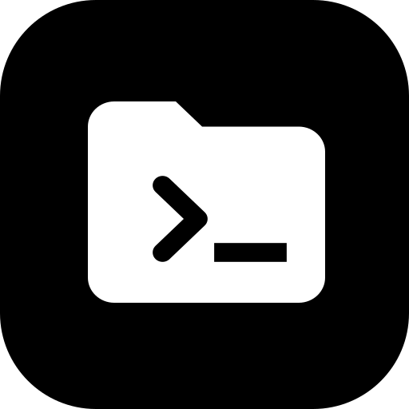
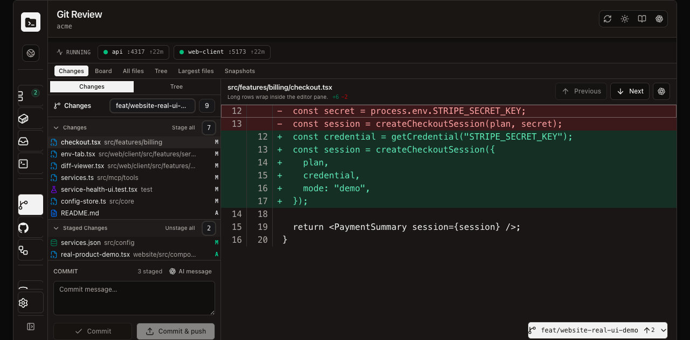
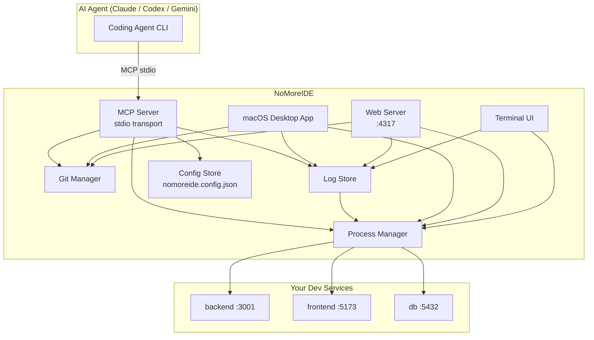

<div align="center">



# NoMoreIDE

**The AI-native terminal workbench for the post-IDE development loop.**

[](https://www.npmjs.com/package/nomoreide)
[](https://www.npmjs.com/package/nomoreide)
[](https://github.com/Rorogogogo/nomoreide/stargazers)
[](LICENSE)
[](https://nodejs.org)
[](https://modelcontextprotocol.io)

Give your coding agents and yourself a **shared local control surface** for services, ports, logs, Git review, GitHub workflows, database work, and MCP workflows — no IDE required.

[Product Tour](#product-tour) · [Download for macOS](#macos-desktop-app) · [MCP Setup](#connect-your-ai-agent) · [CLI Reference](#cli) · [Architecture](#architecture)

</div>

---

> Documentation reviewed for NoMoreIDE **v0.1.99** in **August 2026**. The canonical human and AI references are at [nomoreide.com/docs](https://www.nomoreide.com/docs).

## Product Tour

<div align="center">

<a href="https://www.nomoreide.com/#hero-demo">
  
</a>

<sub>Review a repository, inspect a diff, stage and commit changes, watch running services, and hand context to an agent without leaving the workbench. <a href="https://www.nomoreide.com/#hero-demo">Try the interactive demo</a>—it uses safe mock data.</sub>

</div>

---

## What Is NoMoreIDE?

NoMoreIDE is the shared local control plane between you and your coding agents. The native macOS app, web dashboard, TUI, CLI, and MCP server all operate on the same services, repositories, logs, databases, workflows, and agent configuration.

- **For humans:** one place to run services, inspect activity and Docker resources, review Git worktrees and GitHub changes, diagnose Vercel deployments, browse databases, and open terminals.
- **For agents:** structured MCP tools expose the same live project state to Claude Code, Codex CLI, Gemini CLI, and other MCP clients.
- **For safety:** destructive Git operations are omitted, database writes require human approval, secrets are redacted from shared profiles, and NoMoreIDE does not kill processes it did not start.

---

## Download or Run NoMoreIDE

### macOS Desktop App

Prefer a native app? Download the latest universal DMG for both Apple silicon and Intel Macs:

**[Download NoMoreIDE for macOS](https://www.nomoreide.com/#download)** · [View all releases](https://github.com/Rorogogogo/nomoreide/releases)

> **First launch:** NoMoreIDE is currently unsigned and not notarized, so macOS will block it the first time you open it. After dragging NoMoreIDE to Applications, try to open it once, then go to **System Settings → Privacy & Security**, click **Open Anyway**, and confirm with Touch ID or your password.

### CLI, Web UI, TUI, and MCP Server

One command, no Node.js:

```bash
curl -fsSL https://www.nomoreide.com/install.sh | sh
```

It works out your OS and architecture, downloads the matching release,
**verifies its SHA-256 against the release's `SHA256SUMS`**, and installs into
`~/.local/bin` — a single self-contained binary, with the dashboard beside it
under `~/.local/share/nomoreide`. Prebuilt for macOS (Apple silicon and Intel)
and Linux (x86_64 and arm64).

```bash
# a specific version, or somewhere else
curl -fsSL https://www.nomoreide.com/install.sh | sh -s -- --version 0.1.103
curl -fsSL https://www.nomoreide.com/install.sh | sh -s -- --prefix /usr/local

# and to remove it again
curl -fsSL https://www.nomoreide.com/install.sh | sh -s -- --uninstall
```

Every archive also carries [build provenance](https://docs.github.com/actions/security-guides/using-artifact-attestations-to-establish-provenance-for-builds)
signed through Sigstore, so you can check where it was built rather than only
that it downloaded intact:

```bash
gh attestation verify nomoreide-0.1.103-aarch64-apple-darwin.tar.gz --repo Rorogogogo/nomoreide
```

<details>
<summary>Or run it through npm (deprecated)</summary>

The npm package remains published for a deprecation window and needs Node.js 20
or newer. It is a compatibility shim, not the canonical runtime — new releases
are the native binaries above.

```bash
npx -y nomoreide
```

</details>

Use the agent-specific commands below to connect NoMoreIDE as an MCP server.

---

## Connect Your AI Agent

Install the NoMoreIDE MCP server together with its triggerable debugging skill:

```bash
nomoreide setup codex
nomoreide setup claude
nomoreide setup gemini
```

Run the command for your agent, then start a new agent session. The skill routes
run, start, debug, crash, log, health, and port-conflict requests through the
shared NoMoreIDE daemon instead of launching duplicate development processes.
NoMoreIDE also advertises the same behavior through MCP initialization
instructions for clients that support them.

Setup writes the absolute path of the installed binary, so an agent launched
from a desktop session finds it whether or not it inherited your shell's PATH.

Setup is idempotent, and running it again after an upgrade replaces NoMoreIDE's
own entry in place — including an older `npx -y nomoreide` one, which it
recognises and upgrades. It stops only when the `nomoreide` MCP server already
configured is **not** one of ours; review it, then rerun with `--force` to
replace it and keep a backup. A `nomoreide-debug` skill that differs from the
bundled one is copied aside and replaced, and the backup path is printed.
Project-scoped MCPs and skills are not changed by this user-level setup and can
override it inside that project.

The agent-specific commands below install only the local stdio MCP server and
remain available for manual setup.

### Claude Code

```bash
claude mcp add --transport stdio nomoreide -- nomoreide mcp
```

> Want to share the config with your whole team? Use project scope to commit a `.mcp.json`:
>
> ```bash
> claude mcp add --transport stdio --scope project nomoreide -- nomoreide mcp
> ```

Then confirm inside Claude Code:

```
/mcp
```

<details>
<summary>Manual config (<code>.mcp.json</code> or Claude settings)</summary>

```json
{
  "mcpServers": {
    "nomoreide": {
      "command": "npx",
      "args": ["-y", "nomoreide"]
    }
  }
}
```

</details>

---

### Codex CLI

```bash
codex mcp add nomoreide -- nomoreide mcp
```

<details>
<summary>Manual config (<code>~/.codex/config.toml</code>)</summary>

```toml
[mcp_servers.nomoreide]
command = "npx"
args    = ["-y", "nomoreide"]
```

</details>

Then confirm inside Codex:

```
/mcp
```

---

### Gemini CLI

Open your Gemini CLI settings file (`~/.gemini/settings.json` or the path shown by `gemini config`) and add:

```json
{
  "mcpServers": {
    "nomoreide": {
      "command": "nomoreide",
      "args": ["mcp"]
    }
  }
}
```

If Gemini CLI does not inherit your shell's PATH, use the absolute path
(`~/.local/bin/nomoreide`, spelled out) — which is what `nomoreide setup gemini`
writes for you.

Restart Gemini CLI, then verify:

```
/mcp
```

---

### Local Checkout (any agent)

If you prefer to point agents at a locally built binary instead of an installed
release, build it and name it directly — `cargo build --release` puts it at
`target/release/nomoreide`:

```json
{
  "mcpServers": {
    "nomoreide": {
      "command": "/absolute/path/to/nomoreide/target/release/nomoreide",
      "args": ["mcp"]
    }
  }
}
```

Running `nomoreide setup <agent>` from a checkout writes exactly this, naming
whichever binary ran it.

---

## Architecture



---

## Feature Overview

| Feature | CLI | TUI | Desktop / Web | MCP |
|---|:---:|:---:|:---:|:---:|
| Start / stop / restart services | ✓ | ✓ | ✓ | ✓ |
| Bundle orchestration | ✓ | | ✓ | ✓ |
| Port conflict detection | | | ✓ | ✓ |
| Real-time log streaming | ✓ | ✓ | ✓ | ✓ |
| Activity and resource monitoring | | | ✓ | |
| Docker resources and Compose | | | ✓ | |
| Git status & diff | ✓ | | ✓ | ✓ |
| Stage / unstage / commit | ✓ | | ✓ | ✓ |
| Branch management | ✓ | | ✓ | ✓ |
| Clone, push, worktrees, and snapshots | | | ✓ | ✓ |
| GitHub PRs / issues / Actions | | | ✓ | ✓ |
| Vercel projects / deployments / logs | | | ✓ | ✓ |
| Reusable git/GitHub workflows | | | ✓ | |
| Event-driven workflow triggers | | | ✓ | |
| Database browse and SQL query | ✓ | | ✓ | ✓ |
| Human-approved SQL writes | | | ✓ | |
| Agent tools, hooks, plugins, usage | | | ✓ | |
| Agent environments (live MCPs & skills) | ✓ | | ✓ | ✓ |
| Agent profiles (snapshot / apply / share) | ✓ | | ✓ | ✓ |
| Hosted profile registry (publish / install) | ✓ | | ✓ | ✓ |
| Safe Git (no force-push, no reset) | ✓ | ✓ | ✓ | ✓ |

---

## Running the Interfaces

### MCP Server (default)

```bash
nomoreide
# or from source:
npm run dev
```

### Terminal UI

```bash
nomoreide tui
```

### Database CLI

```bash
nomoreide db list
nomoreide db schemas app
nomoreide db objects app --schema public
nomoreide db describe app --key <opaque-key>
nomoreide db script app --key <opaque-key>
nomoreide db sample app public.users --limit 25
nomoreide db query app --sql "SELECT * FROM users" --limit 25
```

### Web Dashboard

```bash
nomoreide web
# custom port:
nomoreide web --port=4320
```

The web dashboard is available at `http://127.0.0.1:4317` by default.

---

## CLI

### Services

```bash
# Register a local service
nomoreide add service backend \
  --command "npm run dev" \
  --cwd /absolute/path/to/backend \
  --port 3001

# Register a Docker Compose service
nomoreide add service api \
  --kind docker-compose \
  --cwd /absolute/path/to/infra \
  --compose-file docker-compose.yml \
  --compose-service api \
  --port 3001

# Register a remote SSH service (uses your local SSH config and agent)
nomoreide add service staging-api \
  --kind ssh \
  --host devbox \
  --cwd /srv/app \
  --command "npm run dev" \
  --port 3001

# Register a bundle (ordered group of services)
nomoreide add bundle full-stack db backend frontend

# List everything
nomoreide list

# Lifecycle
nomoreide start backend
nomoreide stop backend
nomoreide restart backend
nomoreide start full-stack
nomoreide stop full-stack

# Logs (in-memory, current process)
nomoreide logs backend
```

### Git

NoMoreIDE exposes **read-safe** Git operations only — no hard reset, no clean, no force push, no branch deletion.

```bash
# Status & diff
nomoreide git status --cwd /path/to/repo
nomoreide git diff   --cwd /path/to/repo

# Staging & committing
nomoreide git stage   --cwd /path/to/repo src/index.ts README.md
nomoreide git unstage --cwd /path/to/repo src/index.ts
nomoreide git commit  --cwd /path/to/repo --message "feat: add dashboard"

# History
nomoreide git log --cwd /path/to/repo

# Branches
nomoreide git branch        --cwd /path/to/repo
nomoreide git fetch         --cwd /path/to/repo
nomoreide git switch        --cwd /path/to/repo feature/my-work
nomoreide git create-branch --cwd /path/to/repo feature/new-work

# Register repos for the web UI
nomoreide git add-repo    app --path /path/to/repo
nomoreide git select-repo app
```

### Agent Environments & Profiles

Inspect and manage your coding agents' MCP servers and skills (Claude Code,
Codex CLI, Antigravity), and bundle them into portable profiles. Formerly the
standalone `brainctl` package — see the
[migration guide](docs/brainctl-migration.md).

```bash
# Live agent configuration (read-only)
nomoreide agents status          # per-agent install state, MCP + skill counts
nomoreide agents doctor          # config sanity checks
nomoreide agents read claude     # dump one agent's live config as JSON

# Profiles: named bundles of MCP servers + skills
nomoreide profile list
nomoreide profile snapshot claude my-setup    # capture an agent's live config
nomoreide profile apply my-setup codex --dry-run
nomoreide profile apply my-setup codex        # backs up the config first
nomoreide profile export my-setup             # credential-redacted .tar.gz
nomoreide profile import my-setup.tar.gz --as teammate-setup

# Hosted registry (sign in via the web UI, or set BRAINCTL_API_TOKEN)
nomoreide profile publish my-setup --slug my-setup --title "My Setup"
nomoreide profile install my-setup
```

Exports and published packages never contain raw secrets — secret-looking
values are redacted to `${credentials.*}` placeholders that importers fill
from their own environment.

---

## MCP Tools

All tools are prefixed with `nomoreide_` and are available to any connected MCP client.

### Service Tools

| Tool | Description |
|---|---|
| `nomoreide_list_services` | List all registered services and bundles |
| `nomoreide_register_service` | Register a new service |
| `nomoreide_start_service` | Start a registered service |
| `nomoreide_stop_service` | Stop a running service |
| `nomoreide_restart_service` | Restart a running service |
| `nomoreide_read_logs` | Read recent in-memory logs for a service |
| `nomoreide_register_bundle` | Register a bundle of services |
| `nomoreide_start_bundle` | Start all services in a bundle |
| `nomoreide_stop_bundle` | Stop all services in a bundle |
| `nomoreide_status` | Overall server status |
| `nomoreide_service_context` | Build a copy-paste agent context packet for a service |
| `nomoreide_service_health` | Computed health summaries (one service or all) |
| `nomoreide_timeline` | Recent debug timeline events (optionally per service) |
| `nomoreide_open_ui` | Open the local web UI |
| `nomoreide_close_ui` | Close the local web UI |

### Git Tools

| Tool | Description |
|---|---|
| `nomoreide_git_status` | Show working tree status |
| `nomoreide_git_diff` | Show unstaged diff |
| `nomoreide_git_staged_diff` | Show staged diff |
| `nomoreide_git_log` | Show recent commits |
| `nomoreide_git_branches` | List branches |
| `nomoreide_git_fetch` | Fetch from remote |
| `nomoreide_git_switch_branch` | Switch to a branch |
| `nomoreide_git_create_branch` | Create a new branch |
| `nomoreide_git_stage` | Stage specific files |
| `nomoreide_git_unstage` | Unstage specific files |
| `nomoreide_git_commit` | Commit staged changes |
| `nomoreide_git_push` | Push a reviewed branch with resolved credentials |
| `nomoreide_git_clone` | Clone an HTTPS or SSH repository into a scoped destination |
| `nomoreide_git_register_repository` | Register a repo path |
| `nomoreide_git_select_repository` | Select the active repo |
| `nomoreide_git_worktrees` / `create_worktree` / `select_worktree` / `prune_worktrees` | Inspect and manage isolated Git worktrees |
| `nomoreide_snapshots_list` / `nomoreide_snapshot_create` | Inspect or create safe repository snapshots |

### Database Tools

| Tool | Description |
|---|---|
| `nomoreide_list_databases` | List registered database connections with masked URLs |
| `nomoreide_register_database` / `nomoreide_check_database` | Register or verify a connection without exposing credentials |
| `nomoreide_db_schemas` / `nomoreide_db_objects` | Walk the live database catalog |
| `nomoreide_db_object_details` | Read structure, definitions, and executable create scripts |
| `nomoreide_db_tables` | List tables and views for a connection |
| `nomoreide_db_sample` | Sample rows and schema metadata |
| `nomoreide_db_query` | Run read-only SQL queries; writes are rejected and staged for the Web UI SQL console |

### GitHub Tools

| Tool | Description |
|---|---|
| `nomoreide_github_set_token` | Store a GitHub token for API access |
| `nomoreide_github_list_prs` / `nomoreide_github_get_pr` | Inspect pull requests |
| `nomoreide_github_get_pr_diff` | Fetch a pull request diff |
| `nomoreide_github_create_pr` / `nomoreide_github_merge_pr` | Create or merge pull requests with explicit user intent |
| `nomoreide_github_list_issues` / `nomoreide_github_get_issue` | Inspect issues |
| `nomoreide_github_list_issue_comments` / `nomoreide_github_add_issue_comment` | Read or add issue and PR comments |
| `nomoreide_github_create_issue` | Create an issue |
| `nomoreide_github_get_commit_ci` | Inspect commit check status |
| `nomoreide_github_list_workflow_runs` | List recent GitHub Actions workflow runs |

### Vercel Tools

| Tool | Description |
|---|---|
| `nomoreide_vercel_list_projects` | List accessible Vercel projects for the selected scope |
| `nomoreide_vercel_list_deployments` | List project deployments and current state |
| `nomoreide_vercel_get_deployment` | Inspect one deployment and its metadata |
| `nomoreide_vercel_deployment_logs` | Read deployment build logs for diagnosis |

Vercel MCP tools are read-only. Redeploy, cancel, promote, and rollback remain explicit human actions in the dashboard.

### Agent Environment & Profile Tools

| Tool | Description |
|---|---|
| `nomoreide_agents_status` / `nomoreide_agents_read_configs` | Live agent install state and MCP/skill configuration |
| `nomoreide_agents_doctor` | Agent config sanity checks |
| `nomoreide_agents_add_mcp` / `nomoreide_agents_remove_mcp` | Add or remove an MCP server (config backed up first) |
| `nomoreide_agents_move_mcp_scope` / `nomoreide_agents_move_skill_scope` | Copy/move MCPs and skills between agents and scopes |
| `nomoreide_agents_snapshot_agent` | Back up an agent's config files |
| `nomoreide_profiles_list` / `get` / `create` / `update` / `delete` | Profile CRUD |
| `nomoreide_profiles_snapshot` / `nomoreide_profiles_apply` | Capture a live agent into a profile / apply one (dry-run preview) |
| `nomoreide_profiles_export` / `nomoreide_profiles_import` | Credential-redacted portable archives |
| `nomoreide_profiles_publish` / `nomoreide_profiles_install_from_registry` | Share profiles through the hosted registry |
| `nomoreide_profiles_register_github` | Register a GitHub repo as a registry profile |
| `nomoreide_docs` | Fetch a focused documentation topic or canonical docs links |

---

## Example Configurations

### Service Definition (via MCP)

```json
{
  "name": "backend",
  "command": "npm run dev",
  "cwd": "/absolute/path/to/project/backend",
  "port": 3001,
  "env": {
    "NODE_ENV": "development"
  },
  "description": "REST API server"
}
```

### Bundle Definition (via MCP)

```json
{
  "name": "full-stack",
  "services": ["db", "backend", "frontend"]
}
```

Start the whole stack in one call:

```json
{ "name": "full-stack" }
```

---

## Safety Model

NoMoreIDE is designed to be **safe for AI agents to call without guard rails**:

- Does not scan or enumerate the whole filesystem
- Does not kill processes it did not start
- Reports port conflicts instead of terminating the occupying process
- Git tools omit all destructive operations (no `reset --hard`, `clean`, `push --force`, or `branch -D`)
- Database MCP tools are read-only; writes are staged for the human-only SQL console
- Database writes require explicit unlock, preview, and commit
- GitHub create/comment/merge tools require a configured token and explicit user intent
- Vercel MCP tools are read-only; deployment mutations remain in the human dashboard
- Agent environment writes create backups; exported and published profiles redact credentials
- Config is scoped to `~/.config/nomoreide/config.json`
- Logs are written only to `~/.nomoreide/logs/`

---

## Development

```bash
npm test        # run the full test suite (vitest)
npm run build   # compile TypeScript → dist/
npm run dev     # run from source (tsx)
```

---

## Contributing

Issues and pull requests are welcome at [github.com/Rorogogogo/nomoreide](https://github.com/Rorogogogo/nomoreide/issues).  
If this tool saved you from opening VS Code today, consider leaving a ⭐.

---

<div align="center">

AGPL-3.0 + Commercial · Built by [Rorogogogo](https://github.com/Rorogogogo)

</div>

## License

This project is **dual-licensed**:

- 🆓 **AGPL-3.0** — free for personal use, open-source forks, and projects themselves open-sourced under a compatible license. See [LICENSE](LICENSE).
- 💼 **Commercial license** — required for closed-source products, proprietary internal tools, or paid / hosted services where AGPL-3.0's copyleft and network-use obligations don't fit. See [COMMERCIAL.md](COMMERCIAL.md).

### Do I need a commercial license?

| Use case | License |
|---|---|
| Personal use / running locally | AGPL-3.0 (free) |
| Forking and publishing under AGPL-3.0 | AGPL-3.0 (free) |
| Bundling into a closed-source product | **Commercial** |
| Hosting a modified version as a SaaS without publishing source | **Commercial** |
| Internal company tool not open-sourced | **Commercial** |

For a commercial license, contact **Robert Wang** at **xwang.robert@gmail.com** — see [COMMERCIAL.md](COMMERCIAL.md) for what to include in your request.
